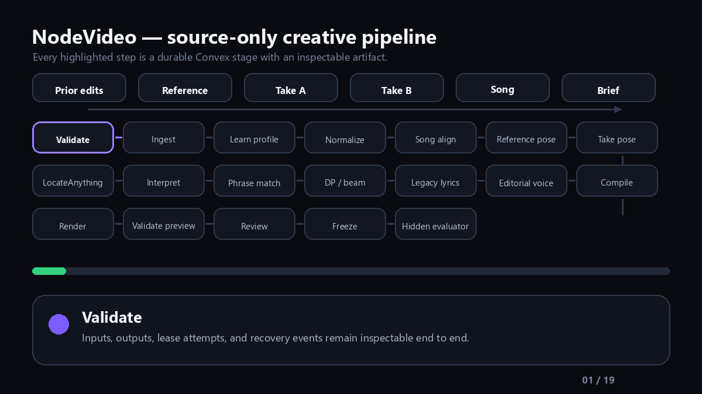

# NodeVideo

NodeVideo is a local-first, artifact-driven editor for short-form creator productions. Dance is the
first deeply instrumented profile, while the creator-taste and audit contracts also cover tutorials,
talking-head videos, comedy, montage, and other formats. Its primary workflow is:

> authorized prior productions -> reusable creator profile -> new source/reference media + brief
> -> source-only interpretation -> global edit and editorial plan -> fixed render -> freeze
> -> evaluator-only conjunctive fidelity gates



The product value is the completed editorial outcome: understanding the choreography, choosing the
right performance for each musical phrase, cutting on intentional beats, keeping text off the body,
muting unusable camera audio, and handing the creator a usable export or licensed-platform music
handoff. Agents choose and explain; versioned primitives measure; typed artifacts control fixed
render code.

## Deployment replay

[Open the NodeVideo production entry point](https://nodevideo-pi.vercel.app/). When this branch is
deployed, it presents the song-conditioned replay on laptop and phone with no sign-in. Vercel serves
hash-bound replay artifacts; heavy media analysis and rendering remain local or in a media worker.

The [animated 19-stage pipeline](https://nodevideo-pi.vercel.app/proof/nodevideo-live-pipeline.gif)
and [live LocateAnything comparison](https://nodevideo-pi.vercel.app/proof/locateanything-side-by-side.jpg)
are also served by the production deployment.

The foreground demo is a deterministic six-second public fixture with:

- one generated original choreography reference;
- two generated creator takes;
- a public-domain generated song segment;
- source-only beat/phrase and pose evidence;
- three body-safe timed text cues;
- muted camera audio; and
- canonical analysis, plan, render, read-log, and freeze artifacts.

[The public replay route](https://nodevideo-pi.vercel.app/media/song-conditioned-auto-edit-v1/preview.mp4)
and [its manifest route](https://nodevideo-pi.vercel.app/media/song-conditioned-auto-edit-v1/manifest.json)
are published with this branch.
This validates mechanics and isolation, not generalized creative taste or arbitrary human-pose
accuracy. A separate research-only live receipt exercises NVIDIA LocateAnything on the supplied
case; one successful frame is not a grounding-accuracy benchmark.

The branch also publishes the supplied real-media case as a silent picture-only calibration via its
[44.5-second plan route](https://nodevideo-pi.vercel.app/media/song-conditioned-real-calibration-v1/picture-only-preview.mp4)
and [score-manifest route](https://nodevideo-pi.vercel.app/media/song-conditioned-real-calibration-v1/manifest.json).
No commercial soundtrack or source container is included in that new public preview.

## Reusable creator profile and production audit

`nodevideo.creator-taste-audit` converts authorized production evidence into a versioned
`CreatorTasteProfile`. Each learned value retains supporting production counts, confidence, and
evidence references across editorial attention, creator voice, spatial grammar, visual treatment,
identity, CTA, and end-card behavior. One-production profiles are explicitly provisional.

The same pack audits candidate productions and validates the evaluator's target interpretation.
If the claimed spec cannot explain visible OCR roles, persistent branding, layout zones, grade, or
delivery, creative scoring is invalid. Once that prerequisite passes, provenance, structure,
semantic overlays, layout, visual treatment, creator identity, and delivery are conjunctive gates:
every required gate must pass. `NodeAgent` proposes profile/audit candidates; NodeVideo retains
schema, hash, project-boundary, persistence, and owner-review authority.

```powershell
npm run taste:audit -- `
  --input .qa/evidence/private/style-gap-audit/style-gap-report.json `
  --out .qa/evidence/private/creator-taste/run.json `
  --profile-id creator-taste.owner-v1 `
  --content-kind dance `
  --derive-target-spec
```

`--derive-target-spec` is for an owner-authorized reference-learning run. Omit it when auditing an
existing interpretation so the consistency gate can expose missing semantics instead of silently
repairing them.

For each production, `npm run production:audit` produces content-neutral frame, OCR, edit-plan, and
seven-gate evidence. `--reuse-observations-from` makes evaluator changes cheap to replay while
preserving the original observations and disclosure. This is how the same NodeAgent workflow can
evaluate dance, tutorials, talking-head clips, comedy, and montage work without introducing a new
custom renderer or scoring script for each format.

Kinetic text is represented as discrete overlay events rather than one lyric-length caption. The
fixed renderer width-fits each cue, emits an inspectable glyph box, and `npm run overlay:clearance`
checks that box against Pose Landmarker evidence from the rendered timeline. More than five percent
body overlap blocks approval, including collisions that occur only near a cut boundary.

## How the edit is interpreted

The source-only analyzer aligns time-indexed normalized poses from each take to the original dance,
maps the user-chosen song's beats and downbeats, and builds a choreography candidate lattice. A
global DP/beam search chooses phrase boundaries and takes from motion completion, gesture apex,
lyric, onset, beat, and downbeat evidence. A fixed beat grammar is not an optimizer input.

Every phrase candidate records choreography agreement, completeness, framing, expression/quality,
and embodied-layout evidence. A quality gate allows contrast between takes without selecting a
materially worse performance. Optional timed lyrics are placed in normalized safe zones outside the
grounded body/face; missing or ambiguous grounding stops for manual review instead of inventing a
result.

Generation produces four canonical boundaries:

1. `ChoreographyAnalysis` (`nodevideo.choreography-analysis.v1`);
2. `SongConditionedPlan` (`nodevideo.song-conditioned-plan.v1`);
3. `EditPlan` (`nodevideo.edit-plan.v1`); and
4. `Freeze` (`nodevideo.choreography-freeze.v1` plus a wrapper receipt).

The EditPlan routes the chosen song and explicitly mutes audio from every take. It drives the fixed
renderer in [`scripts/workers/edit-plan-renderer.mjs`](scripts/workers/edit-plan-renderer.mjs); an
agent cannot inject JSX, CSS, shell commands, or a bespoke FFmpeg graph. The evaluator verifies all
frozen hashes before it can open a held-out target plan.

Read the full workflow, artifact contracts, rights boundary, proof ledger, and exact evaluator
command in [`docs/song-conditioned-pipeline.md`](docs/song-conditioned-pipeline.md).

## Live LocateAnything sidecar

NodeVideo now includes a real `/health` + `/locate` sidecar backed by NVIDIA's official free queued
Hugging Face Space. Copy `.env.example` to `.env`, review the NVIDIA code and model licenses, and set
`NODEVIDEO_LOCATEANYTHING_LICENSE_ACCEPTED=true` only for permitted research/non-commercial use.
The included registry points at the public proof frame; replace it with a private ignored registry
for local assets.

```bash
npm run grounding:sidecar
node --env-file=.env scripts/quality/grounding-doctor.mjs --json
```

The free endpoint can sleep, queue, or rate-limit. `HF_TOKEN` is optional for the public Space but
recommended for an identifiable Hugging Face quota. The same typed contract can target an
operator-managed local worker without changing choreography or caption-planning callers.

## What the supplied-case calibration proves

The real-media generation interface never accepted the final target picture or target plan. It used
Source A as a disclosed creator-selected choreography fallback, aligned Source B by normalized pose,
applied the beat template, selected A/B/A/B/A over five phrases, rendered, and froze. Only then did
the evaluator open the target plan. This is an audited CLI/read-log boundary, not an OS sandbox.

| Post-freeze measure | Result |
| --- | ---: |
| Cut F1 at `0.75 s` tolerance | `0.909091` |
| Mean nearest-cut error | `0.366667 s` |
| Maximum nearest-cut error | `0.633333 s` |
| Neutral source agreement | `5 / 5` phrases |
| Duration | `44.5 s` generated / `44.5 s` target |
| Taste status | `not-evaluated` |

These are legacy proximity diagnostics, not an editorial pass. The `0.75 s` tolerance is too loose
for dance editing, and the nearest-cut aggregate does not replace signed, frame-level accounting.
The supplied-case reconstruction verdict is therefore **failed** under the current two-frame gate.

This is a target-picture-isolated, **target-audio-oracle calibration**. The exact authorized audio
excerpt was supplied as timing input, so it does not prove song identity/excerpt selection or blind
creative taste. The current supplied case also lacks an independent original choreography video, an
independent creator-supplied song master/segment, and timed lyrics. Source A is therefore a clearly
labeled fallback reference, and no lyric overlay is invented.

The earlier owner-authorized V2 target-guided reconstruction remains useful forensic/render
calibration, not source-only planning proof. V1 remains immutable failure evidence, including its
wrong `16.067-19.633 s` phrase and missing music/text. See
[`docs/authorized-case-v2-forensics.md`](docs/authorized-case-v2-forensics.md).

## Run locally

Requirements: Node.js 22+, npm 10+, Chromium for browser tests, and FFmpeg/FFprobe for regeneration
or independent media verification.

```bash
npm ci
cp .env.example .env
npm run dev
```

In PowerShell, use `Copy-Item .env.example .env`. Open `http://localhost:4173` from the laptop, or
use the laptop's LAN address from a phone on the same network; Vite is configured to listen on the
host interface.

When the private integrated render exists at
`.qa/evidence/private/integrated-inspector-v1/frozen-generation-v5/source-only-song-preview.mp4`,
`npm run dev` exposes it through a byte-range-capable development-only route. The generated-edit
player then shows **Local soundtrack enabled**, plays the AAC soundtrack, and drives the shared
frame inspector while it plays. Set `NODEVIDEO_LOCAL_PREVIEW` to another private MP4 path to
override the default. `npm run build`, `npm run preview`, Git, and Vercel continue to use the silent
hash-bound public preview; outside the Vite development server the private URL never returns video
bytes (static hosts may route the unknown URL to the HTML application shell).

Run the complete capability/grounding/worker health check:

```powershell
npm run doctor
```

Regenerate and verify the public-domain song-conditioned replay:

```powershell
npm run proof:song:public
```

Verify the published real-case calibration without private media:

```powershell
npm run proof:song:real:verify
```

Run the post-freeze evaluator explicitly:

```powershell
npm run eval:song -- `
  --freeze .qa/evidence/private/song-conditioned-source-only-v1/freeze-receipt.json `
  --generated-plan .qa/evidence/private/song-conditioned-source-only-v1/edit-plan.json `
  --target-plan .qa/evidence/private/reference-analysis-v2/edit-plan-reviewed.json `
  --output .qa/evidence/private/song-conditioned-source-only-v1/post-freeze-evaluation.json `
  --allow-target-audio-oracle
```

Do not run the evaluator until the generation freeze exists. Omit
`--allow-target-audio-oracle` for a normal source-only case.

## Grounding without lock-in

The same provider-neutral `LocateRequest`, `LocateResult`, and `GroundingHealth` contract supports:

- deterministic `replay` geometry for CI;
- creator-reviewed `manual` geometry;
- an explicit fail-closed `disabled` profile; and
- an optional operator-managed LocateAnything HTTP sidecar.

The default demo needs no model or GPU. `npm run grounding:doctor` does not contact a model service,
download weights, or accept a license. Durable artifacts contain trace/asset IDs and normalized
geometry, not raw frames, local paths, credentials, or vendor payloads.

LocateAnything code and weights have separate terms: the upstream
[Eagle code license](https://github.com/NVlabs/Eagle/blob/main/LICENSE) is Apache-2.0, while the
[LocateAnything model license](https://github.com/NVlabs/Eagle/blob/main/Embodied/LICENSE_MODEL)
limits noncommercial use to research/evaluation. NodeVideo requires explicit operator license
references and acceptance before an HTTP model profile can activate. It makes no visual-prompt
claim: the released checkpoint is documented as not supporting visual-prompt inference out of the
box.

## Music and Instagram handoff

Owned or otherwise authorized audio can drive preview/export when its rights attestation is bound to
the plan. For Instagram catalog music, NodeVideo instead supplies the track/search identity,
intended segment, beat/phrase anchors, and visual instructions so the creator can add and confirm the
recording inside Instagram for their account and region. NodeVideo does not redistribute the
commercial file or claim an exact Instagram waveform offset until it is confirmed in-platform.

## Quality gates

```bash
npm run lint
npm run typecheck
npm run test
npm run check:ui
npm run capability:validate
npm run grounding:doctor
npm run worker:verify
npm run worker:song:verify
npm run proof:song:real:verify
npm run build
npx playwright install chromium
npm run test:e2e
```

`npm run check` runs the static, unit, schema, grounding, receipt, UI-policy, worker, real-case proof,
historical-proof, and build gates. Browser QA covers desktop, tablet, and phone widths,
accessibility, keyboard operation, media decoding, and horizontal overflow. The stable selector and
consent contract is in [`.qa/profile.md`](.qa/profile.md).

## Primitive-first implementation

NodeVideo keeps custom maintenance small by composing existing primitives:

- generated shadcn/ui and AI Elements for generic interaction and artifacts;
- react-o11y for recorded trace presentation;
- NodeAgent-style typed tools, deterministic receipts, and validation;
- Convex workflow/event patterns for durable orchestration;
- MediaPipe pose evidence, librosa beat/onset analysis, OpenTimelineIO interchange, and FFmpeg fixed
  rendering; and
- provider-neutral grounding rather than vendor-specific plan fields.

`npm run check:ui` rejects raw generic controls, direct Radix imports, inline layout styles,
arbitrary Tailwind dimensions, extra authored stylesheets, and custom media queries. See
[`docs/ui-primitives.md`](docs/ui-primitives.md).

## Repository guide

- [`packs/song-conditioned-auto-edit/`](packs/song-conditioned-auto-edit/) - source-only schemas,
  tools, claims, and replay gates.
- [`packs/embodied-grounding/`](packs/embodied-grounding/) - provider-neutral grounding contract and
  license boundary.
- [`fixtures/media/song-conditioned-auto-edit-v1/`](fixtures/media/song-conditioned-auto-edit-v1/) -
  public-domain reference/takes/song plus canonical artifacts and preview.
- [`fixtures/media/song-conditioned-real-calibration-v1/`](fixtures/media/song-conditioned-real-calibration-v1/) -
  target-isolated real-case artifacts, silent preview, and post-freeze score.
- [`scripts/analysis/song_choreography_analyzer.py`](scripts/analysis/song_choreography_analyzer.py) -
  source-only pose/song interpretation.
- [`scripts/quality/evaluate-song-conditioned.mjs`](scripts/quality/evaluate-song-conditioned.mjs) -
  freeze-first target evaluator.
- [`docs/song-conditioned-pipeline.md`](docs/song-conditioned-pipeline.md) - detailed workflow and
  proof ledger.
- [`docs/architecture.md`](docs/architecture.md) - system responsibility and evidence boundaries.
- [`docs/NODEKIT_EVE_BROWNFIELD_MAP.md`](docs/NODEKIT_EVE_BROWNFIELD_MAP.md) - mapping from
  the existing Eve control plane into the canonical NodeAgent application contract.
- [`fixtures/media/blind-source-only-pilot-01/`](fixtures/media/blind-source-only-pilot-01/) - earlier
  blind exploration retained as secondary evidence, not the primary product contract.

## Claim boundary

The checked-in synthetic replay proves deterministic mechanics. The supplied real case is a
target-picture-isolated development calibration under a disclosed target-audio oracle; it does not
pass strict editorial timing. The newer integrated case proves independent-reference ingestion,
target isolation, artifact integrity, and `5 / 5` source choices, but its signed boundary errors are
`-3, -8, +5, +5, -2` frames, with one additional unmatched target boundary. Its strict verdict is
also **failed**. Neither case proves general creative taste. See
[`docs/strict-editorial-audit.md`](docs/strict-editorial-audit.md).
