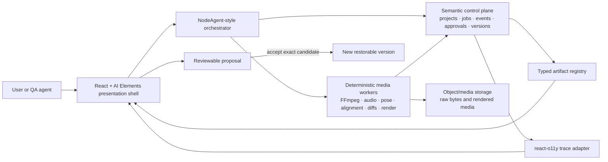
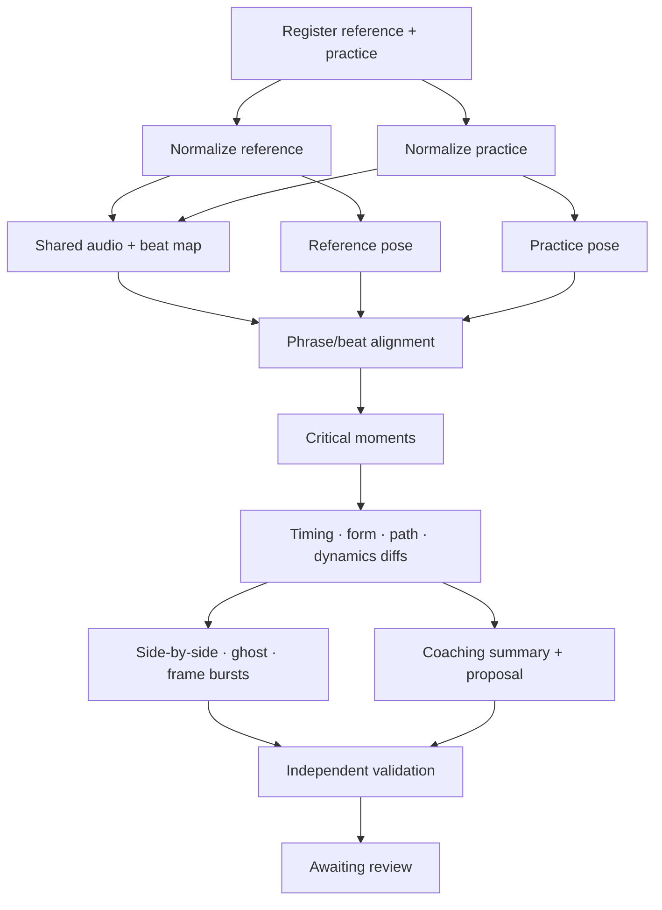

# NodeVideo architecture

## Architectural decision

NodeVideo has one semantic control plane and one deterministic media data plane. The control plane decides and records *what* should run; versioned workers perform frame/audio math and return typed artifacts. React renders those records. No UI component, hidden model prompt, or synthetic fixture is allowed to manufacture successful provenance.

The browser-local MVP implements the same event, artifact, proposal, trace, and version boundaries in memory/local storage. It is deliberately narrower than the target deployment and must not be described as durable server execution.

## Layer ownership

| Layer | Owns | Does not own | Reuse source |
|---|---|---|---|
| Presentation shell | first-run, local upload affordance, plan/progress cards, artifact/trace panels, proposal review, versions | orchestration policy, frame math, invented receipts | Parity Studio and selected AI Elements patterns |
| Orchestrator | intent, plan, tool selection, dependencies, job lifecycle, cancellation/retry, artifact emission, validation requests | React layout, pixel/frame reasoning, silent mutation | NodeAgent typed tools and durable-runtime patterns |
| Semantic control plane | projects/assets metadata, jobs/stages/events, artifacts, approvals, versions, comments, traces, presence | heavy video/audio bytes | NodeRoom/Convex schemas and append-only event patterns |
| Trace adapter | span hierarchy, status, timing, filters, artifact/timeline focus | domain decisions or synthetic timing | NodeRoom trace contract plus `@assistant-ui/react-o11y` |
| Media workers | probe/normalize, thumbnails/waveforms, beat/onset, pose, alignment, trajectory/form/dynamics diffs, previews/bursts, export | conversational planning or approval | versioned FFmpeg and purpose-built deterministic workers |
| Release proof | UI journeys, screenshots/video, FFprobe checks, held-out fixtures | substituting a demo for analytical correctness | FeatureClipStudio proof workflow |

## Current MVP boundary

The current slice is browser-local and uses two explicitly different source modes:

- `synthetic`: public deterministic fixtures generated by `nodevideo-demo`; safe for CI and hosted previews. Every synthetic asset/artifact carries a visible disclosure.
- `local-file`: metadata and a session-only browser object URL for user-selected media. Bytes remain in the browser session. Checkpoints may preserve metadata and provenance but not the media capability itself.

This boundary gives the product an honest, testable UI/runtime seam while real workers are added. A synthetic `comparison-preview` without `mediaUrl` is an analysis artifact, not a rendered video.

## Control-plane contracts

`src/lib/contracts.ts` is the initial serialization boundary. Records are evidence, not implications that a worker ran.

### Event rules

- Events are immutable and strictly ordered by `sequence` within a runtime.
- A checkpoint has a schema version and is replaced atomically after an event is accepted.
- Stage completion refers to artifact IDs already present in the checkpoint.
- Proposal acceptance is bound to the proposal artifact and creates a new recipe version.
- Restore creates another version; it never rewrites history.
- Unknown or stale state renders as unknown/stalled. The UI cannot infer completion from elapsed time.

The target distributed envelope is `nodevideo.job-event.v1` and adds server identity, idempotency key, attempt, checkpoint cursor, tool version, and signed artifact references without changing the event-derived UI model.

### Stage lifecycle

The MVP domain stages are `ingest`, `normalize`, `audio`, `pose`, `alignment`, `diffs`, `render`, `summary`, and `review`. The distributed runtime expands job status to:

`queued → ingesting → normalizing → mapping_audio → extracting_pose → aligning → detecting_moments → computing_diffs → rendering → summarizing → awaiting_review → completed`

Every stage must also accept `failed` and `cancelled`. Distributed stages are idempotent, retryable, cancellable, checkpointed, observable, and tool-versioned. A retry can reuse a validated artifact by hash; it cannot duplicate a render or proposal acceptance.

### Artifact rules

The browser-local registry starts with asset manifests, audio/pose feature reports, alignment reports, difference reports, comparison previews, summaries, and recipe proposals. The worker-backed target adds:

- `tutorial_comparison`
- `beat_map`
- `pose_diff`
- `critical_moment_burst`
- `coaching_summary`
- `practice_clip`

Each artifact carries `project/run/trace` identity, input asset IDs/hashes, recipe version, tool and version, relevant frame/beat ranges, confidence, status, creation time, and provenance. Large media stays in the media plane and is referenced through short-lived signed URLs.

### Proposal and version invariant

Analysis may recommend a recipe patch, but it cannot apply it. The UI renders before/after values and rationale. Accepting the exact pending candidate creates a version linked to the proposal; declining creates no version. Restore is append-only. Tests must prove double-accept is idempotent and reload cannot apply an unaccepted proposal.

## Happy-path dependency graph

Independent normalize and pose work may run in parallel. These are worker jobs, not LLM subagents. Progressive artifacts appear as soon as their dependencies are satisfied: normalized media enables side-by-side; beat maps enable timeline markers; pose enables ghost/path views; moment detection enables colored markers; summary enables the top corrections. The UI never waits for the full graph to show valid partial results.

## Trace contract

The canonical trace hierarchy mirrors the dependency graph: root `tutorial_compare`, upload children, normalize children, audio/extract/beats/phrases, pose children, alignment, moments, diff children, render children, summary, and validate.

A span can record tool/version, asset IDs/hashes, frame or beat range, cache/retry status, confidence, measured latency, optional provider/model/token/cost receipt fields, artifact IDs, and validation verdict. It never stores raw media, object URLs, local paths, prompts containing media bytes, credentials, or hidden chain-of-thought.

User mode shows plan, status, evidence, outputs, retries, and safe rationale. Developer mode adds tool versions, hashes, timings, attempts, and validation detail. Selecting a span focuses its artifact/timeline range; selecting an artifact focuses its producing span.

## Failure and privacy behavior

- Preserve usable artifacts after a partial failure.
- Offer retry, slower method, manual point/offset, or skip only when the resulting limitations are explicit.
- A failed tool renders an error, not an approval denial or successful fallback.
- Stale progress stops animating and exposes the last server checkpoint.
- Local object URLs are revoked when no longer needed and excluded from persistence, console output, traces, and screenshots.
- CI and hosted previews use only synthetic media. The three user-provided evaluation videos remain outside Git, public artifacts, and cloud test runs.
- Future external model calls require a per-action preflight naming provider, model, source IDs, memory access, read/write scope, and expected egress; the server-authored receipt must match or the action fails closed.

## Capability packs

Domain behavior is packaged behind a manifest, skill instructions, input/output JSON schemas, typed tools, prompts (only where needed), UI renderers, evaluation fixtures, examples, and README. `tutorial-compare` is first; `beat-sync`, `pose-coach`, `reference-reconstruct`, `kinetic-text`, and `practice-clip` follow only after their worker and eval contracts exist.

Initial tool IDs are `media.normalize`, `audio.beat_map`, `pose.extract`, `tutorial.align`, `tutorial.diff`, and `render.comparison`.

## Verification ladder

1. Contract/unit: schema parsing, event ordering, status mapping, renderer exhaustiveness, provenance disclosure, object-URL redaction, proposal/version invariants.
2. Worker goldens: FFprobe normalization, BPM/timestamp tolerance, pose confidence, mirror/offset alignment, critical-moment selection, difference math, burst frame count, hashes and tool versions.
3. Durable integration: enqueue/lease/checkpoint/journal/receipt, retry without duplicate render, stale lease, cancel, resume, partial failure, malformed inputs, and policy blocks.
4. Agentic UI: public synthetic demo, local privacy badge, progressive stages, artifact/trace navigation, proposal review, accept/decline, restore, reload, keyboard access, and truthful degraded states.
5. Release proof: Playwright evidence, FFprobe validation of actual exports, trace export inspection, and a FeatureClipStudio walkthrough. Visual proof supplements deterministic checks; it never upgrades a synthetic demo into a real-analysis claim.

The CI workflow enforces lint, typecheck, unit tests, build, and public synthetic-demo E2E. Real worker/evaluation gates become required before any release claims those capabilities.
