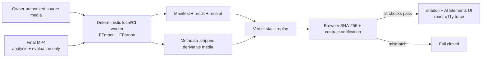
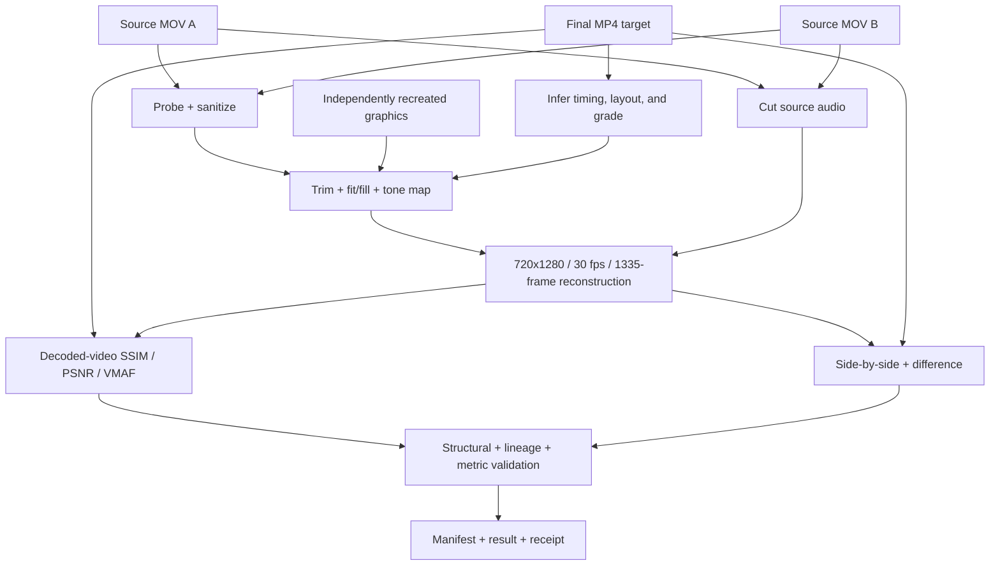

# NodeVideo architecture

## Architectural decision

NodeVideo separates deterministic media execution from public presentation. A versioned FFmpeg
worker performs frame, audio, color, and comparison work locally or in CI and writes typed,
hash-bound artifacts. The Vercel application fetches and verifies those records and media before it
replays them. React never manufactures worker success or implies that FFmpeg ran in the browser.



The target MP4 informs case-specific timing, framing, grade, and evaluation. It is never a
reconstruction render input. Reconstruction pixels come from the two source MOVs and independently
recreated graphics; output audio comes from cut source audio with a silent branded tail.

## Layer ownership

| Layer | Owns | Does not own | Reuse source |
| --- | --- | --- | --- |
| Presentation | consent disclosure, verification state, six media views, measured quality, trace replay | frame math, invented receipts, live-worker claims | generated shadcn/ui and AI Elements |
| Published-case loader | fetching, SHA-256, schema relationships, lineage and metric agreement, fail-closed behavior | media transformation | Web Crypto plus typed case contracts |
| Media worker | probe, sanitization, source selection, trim, fit/fill, color transform, recreated overlays, audio, comparison renders, metrics | browser presentation | FFmpeg/FFprobe and deterministic worker utilities |
| Capability pack | input/output schemas, tool graph, consent and claim rules, evaluation fixture | blanket authorization for another case | versioned pack contract |
| Trace adapter | recorded span hierarchy, status, and timing | orchestration policy or hidden reasoning | `@assistant-ui/react-o11y` |
| Release proof | hashes, decodability, structural assertions, browser journeys, accessibility, responsive layout | turning one case into a generic capability claim | Vitest, Playwright, Axe, FFprobe |

## Current evidence modes

### Owner-authorized real case

The live UI foregrounds `authorized-real-v1`. Publication is limited to metadata-stripped
derivatives covered by explicit owner authorization. The browser hashes the manifest, result,
receipt, and six derivative videos before showing the media, then verifies:

- the target is `analysis-and-evaluation-only` and absent from render inputs;
- both MOV source asset IDs are present in render lineage;
- target audio is neither matched nor copied;
- manifest, result, receipt, media roles, metrics, and hashes agree; and
- the worker receipt and result both report a passing validation.

The reconstruction has exact target structure: 720x1280 at 30 fps, 1,335 frames, 44.5 seconds, and
hard cuts at frames `201`, `482`, `589`, and `753`. Its measured decoded-video result is SSIM
`0.946873`, PSNR `26.311718 dB`, and VMAF `29.819468`. The permitted tier is
`perceptually-close-video`, not pixel-exact reproduction.

This is a case-specific target-guided result. The target soundtrack is not present in the MOV
sources, so the output uses cut source audio and a silent branded tail. The target soundtrack
remains unmatched and was not copied.

### Generated generic smoke proof

The `tutorial-compare` worker uses generated videos with known PCM pulses and color markers. It
remains the default generic fixture and CI smoke proof because it is reproducible without authorized
human media. It validates deterministic worker orchestration and known-marker measurement, not
generic human pose, production music, or arbitrary edit reconstruction.

## Execution and replay boundary

The authorized worker runs locally or in CI. It requires explicit case authorization, probes the
three inputs, writes sanitized release media, reconstructs from both source MOVs, generates web
proxies and comparison views, evaluates decoded video, validates structural assertions, and writes
the result and receipt atomically.

Vercel stores and serves the checked-in derivatives and proof records. It performs no transcoding,
frame matching, tone mapping, or metric calculation. “Verified replay” means the browser checked the
deployed bytes and their recorded relationships; it does not mean the site reran the worker.

The six published video roles are:

1. source A web proxy;
2. source B web proxy;
3. final-target web proxy;
4. source-only reconstruction;
5. target/reconstruction side-by-side; and
6. amplified pixel difference.

The target proxy is present for inspection and evaluation only. Its existence in the UI does not
make it a reconstruction source.

## Authorized reconstruction graph



The graph is deterministic and case-specific. It does not discover an arbitrary edit without a
target, reproduce unavailable music, copy target frames, or execute a model-driven creative agent.

## Contracts and invariants

`packs/reference-reconstruct` defines the real-case boundary through its manifest, skill
instructions, input/output schemas, typed tool registry, and bound evaluation. The following
invariants are release-blocking:

- owner authorization is explicit and scoped to this publication;
- original source-container metadata is not published;
- private local locators do not appear in public records;
- the target is analysis/evaluation-only and excluded from reconstruction render lineage;
- both MOV sources contribute to the output timeline;
- graphics are independently recreated rather than copied target pixels;
- output audio is sourced from the MOVs, target audio is excluded, and the limitation is disclosed;
- output structure and cut frames equal the validated contract;
- metrics are computed from decoded target/reconstruction video with target audio excluded; and
- a failed hash, decode, schema, lineage, or structural check cannot produce a passing receipt.

The `tutorial-compare` capability pack retains its narrower generated-known-marker profile. Passing
that profile does not upgrade or generalize the authorized case, and the authorized case does not
establish blanket publication consent for future media.

## Trace and presentation contract

The real-case receipt records seven measured worker spans: input probing, release sanitization,
reconstruction render, source proxies, target proxy, comparisons, and evaluation. The frontend maps
those records into a headless `react-o11y` trace and presents them with generated AI Elements tool and
checkpoint primitives.

A trace may contain public IDs, hashes, stages, timings, versions, status, artifact roles, and
validation verdicts. It must not contain local source locators, raw container metadata, credentials,
media bytes, or hidden chain-of-thought.

The UI is intentionally a small verification surface. The refactor replaced the earlier bespoke
feature shell with generated shadcn controls, AI Elements artifact/tool/checkpoint primitives, and
the react-o11y trace adapter. Authored UI fell from 889 to 253 logical lines while retaining laptop,
tablet, and phone coverage.

## Failure, consent, and publication behavior

- A hash or contract mismatch blocks media presentation and reports an error.
- Missing or undecodable artifacts fail verification; the UI cannot infer success from a receipt
  label alone.
- Real-media publication requires case-specific authorization; one approved case is not blanket
  consent.
- Published derivatives are metadata-stripped and independently hash-verified.
- The original source-container metadata remains outside the hosted artifact set.
- The target's evaluation role must remain visible anywhere reconstruction quality is claimed.
- Quality language must remain at `perceptually-close-video`; the metrics do not support pixel-exact
  or generic-autopilot language.

## Verification ladder

1. **Contract/unit:** authorization, target exclusion, source lineage, target-audio exclusion, exact
   timeline, view roles, metric agreement, and fail-closed malformed-data paths.
2. **Worker verification:** SHA-256, FFprobe decodability, metadata sanitization, output structure,
   cut frames, decoded-video metrics, and receipt/result schema validation.
3. **Browser integrity:** hash the manifest, result, receipt, and six deployed videos before media
   presentation.
4. **Agentic UI:** owner-consent disclosure, target-role disclosure, quality tier, media switching,
   recorded trace, failure states, keyboard access, Axe, and zero horizontal overflow.
5. **Responsive release proof:** Playwright journeys at 1440, 1280, 834, 390, and 320 CSS pixels,
   followed by the same checks against the public Vercel URL.

Run the non-mutating proof verifiers with:

```powershell
npm run worker:authorized:verify
npm run worker:verify
```

CI also enforces lint, typecheck, unit tests, capability schemas, final UI budgets, production build,
and browser E2E. Broader claims require consent-cleared held-out cases whose evaluations are defined
before their targets are inspected.
