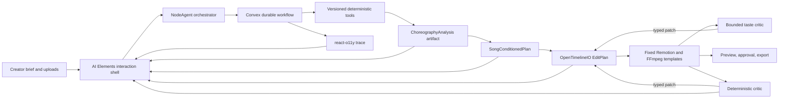
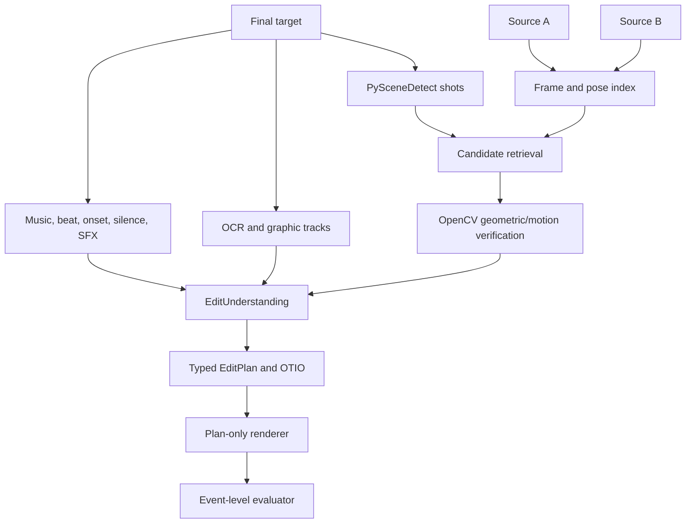

# NodeVideo architecture

## Product outcome

NodeVideo is building an artifact-driven video-editing service. The foreground release now
demonstrates deterministic song-conditioned source-only mechanics: an original choreography
reference, repeated creator takes, a chosen song segment, and optional timed lyrics compile through
typed artifacts into a fixed render and freeze. A separate real-media calibration keeps target
picture and plan outside generation, but uses a disclosed target-audio oracle and therefore does not
prove autonomous song selection or taste. The product is not paid for because it can emit FFmpeg
syntax or React code. It is paid for when it can understand and deliver a creator's intended
outcome: source selection, pacing, music, text, framing, grade, mix, and a usable export.

The architectural rule is:

> The agent handles intent, orchestration, choices, and explanation. Versioned tools produce
> evidence. A typed edit plan controls fixed render templates. Critics may propose typed plan
> patches, never arbitrary code.

## Claims that must stay separate

| Mode | Target access | Allowed render assets | What a pass proves |
| --- | --- | --- | --- |
| Song-conditioned source-only generation | No final picture or target plan before freeze | Creator takes, chosen/authorized song segment, optional timed lyrics; choreography reference is analysis-only | The system can align takes to choreography, make phrase choices, render a typed plan, and freeze without answer leakage |
| Reference understanding | Analyzer sees the final target | None | The system recovered its cuts, sources, music, text, framing, grade, and effects |
| Render fidelity | Renderer receives no final-target container or picture pixels | Generated plan, source footage, licensed assets, and explicitly disclosed target-derived assets | The generated plan and declared assets can reproduce the understood edit |
| Target autonomous editing | Planner and critic never see the target | Raw footage, user brief, owned/licensed catalog | A held-out pass would show preferred-edit creation without answer leakage |

A target-derived soundtrack or grade LUT can be used in an owner-authorized calibration when its
lineage is explicit. Those assets do not permit the target container or target picture pixels to
enter the renderer, and they disqualify that run from blind music-selection or grade evidence.

## Control plane and media plane

The web application is the control plane. Large media and CPU/GPU work stay in a worker/object
storage plane. Vercel presents projects, progress, artifacts, approvals, and replayable evidence; it
does not pretend a browser request performed heavy transcoding.

## Responsibility by layer

| Layer | Owns | Must not own |
| --- | --- | --- |
| AI Elements | conversation, uploads, tool cards, checkpoints, artifact cards, approvals | domain state, frame math, bespoke page layout generated by a model |
| NodeAgent | intent, plan selection, tool calls, retry/cancel policy, artifact explanations | pixel transforms, beat calculations, pose math, arbitrary renderer code |
| react-o11y | trace tree, waterfall, statuses, tool/model metadata | orchestration policy or hidden chain of thought |
| Convex Workflow | durable jobs, retries, leases, events, versions, approvals, lineage | media bytes and heavy media processing |
| Media workers | decoding, analysis, rendering, muxing, objective evaluation | product policy or untyped agent decisions |
| Fixed UI registry | predictable rendering for each artifact type | interpreting free-form model layout instructions |

The current Vite/React application selectively reuses source-distributed shadcn and AI Elements
components. It does not switch frameworks or couple domain state to a chat hook.

## Primitive-first media stack

NodeVideo integrates established primitives behind narrow adapters instead of recreating their core
algorithms.

| Need | Primitive | Adapter output |
| --- | --- | --- |
| Editorial interchange | OpenTimelineIO | `.otio` plus NodeVideo metadata |
| Cut discovery | PySceneDetect | target shot boundaries and confidence |
| Coarse visual retrieval | DINOv2 and Faiss | ranked source-frame candidates |
| Geometric verification | OpenCV | inliers, reprojection error, refined frame offset |
| Body-aware matching/reframe | MediaPipe Pose/Face | landmark tracks, subject boxes, confidence |
| Beat/onset/audio alignment | librosa | beat, onset, tempo, phrase and subsequence evidence |
| Speech timing | Whisper | timestamped transcript with confidence |
| Text extraction | PaddleOCR or EasyOCR adapter | text, boxes, timing, confidence |
| Color management | OpenColorIO and FFmpeg `zscale` | declared transform/LUT artifact |
| Composition | fixed Remotion components | plan-prop composition |
| Encode, loudness, mux | FFmpeg | final media and technical receipt |
| Durable execution | Convex Workflow | resumable job and step events |

Every adapter records its version, parameters, input/output hashes, frame or sample range,
confidence, latency, and artifact IDs.

## Canonical artifacts

### ChoreographyAnalysis

The source-only analyzer binds the exact choreography reference, chosen song excerpt, beat evidence,
take pose alignments, ordered phrases, per-take candidates, and embodied-layout evidence. The
reference is analysis-only. A finished target has no property in this input contract.

### SongConditionedPlan

The planner selects one admissible candidate per phrase, binds any body-safe caption layouts, and
records the compiled EditPlan hash. It can change typed choices and timing; it cannot create a new
renderer implementation.

### EditUnderstanding

The analyzer emits evidence, not renderer instructions:

- source and target shots;
- ranked source candidates and verification confidence;
- beat, onset, phrase, energy, and audio-event maps;
- explicit source-audio routing;
- music identity, excerpt offset, gain, and license/provenance status;
- transcript and text/graphic intervals with normalized boxes;
- crop and subject tracks;
- grade analysis; and
- warnings where evidence is incomplete.

### EditPlan

The planner compiles accepted evidence into a standard timeline:

- one contiguous primary video track with source, freeze, and black clips;
- program, music, voiceover, and effects audio tracks;
- text and graphic overlay tracks;
- frame-accurate video timing and sample-aware audio intent;
- fixed template IDs and normalized boxes;
- beat grid; and
- explicit render, evaluation-only, and target-derived lineage.

The plan cannot carry CSS, JSX, shell commands, or an arbitrary FFmpeg filter graph.

### CriticReport

The critic emits scores, evidence-linked findings, worst windows, and a bounded list of typed
patches such as:

- `replace-clip`;
- `nudge-cut`;
- `set-crop-keyframes`;
- `set-overlay`;
- `set-audio-mix`; and
- `set-grade`.

Objective scores must improve before a patch is accepted. The loop is capped and falls back to
creator review instead of iterating indefinitely.

## Reference-understanding workflow

Evaluator-only ground truth is physically and logically separated. Analyzer, planner, renderer, and
critic code must never import it.

## Song-conditioned source-only workflow

The generator receives an original dance reference, repeated takes, an exact chosen song segment,
optional timed lyrics, and rights/constraint attestations. Deterministic tools align normalized pose,
map beats and phrases, build per-phrase candidates, ground body-safe regions, and compile a typed
plan. Camera audio is muted and only the chosen song is routed to program output. The render and all
generation reads are hash-bound before an evaluator may mount a held-out target.

The public synthetic replay demonstrates those mechanics. The supplied real case demonstrates
target-picture isolation and close timing/source agreement, but lacks an independent choreography
reference, independent song master, and timed lyrics; its exact authorized audio was an oracle.
Human A/B ratings across unseen cases remain the primary release gate for a creative-taste claim.
See [`song-conditioned-pipeline.md`](song-conditioned-pipeline.md).

## Release gates

A release must pass all relevant layers:

1. technical decode, dimensions, frame count, duration, loudness, clipping, and lineage;
2. cut precision/recall and source identity/in-out frame error;
3. crop trajectory and subject safe-area;
4. text content, timing IoU, box IoU, and template match;
5. music identity/license, excerpt offset, beat phase, gain, SFX, source leakage, and A/V sync;
6. overlay-masked per-shot and worst-one-second picture metrics;
7. grade error on aligned non-overlay pixels; and
8. blinded creator preference for autonomous-editing claims.

No global average may hide a release-blocking worst window.

## V1 historical adjudication

The owner-authorized V1 receipt remains immutable evidence of what ran, but its quality verdict is
invalidated:

- output frames 482-588 used Source A frames 866-972; the target uses 942-1048, a 76-frame error;
- 68.28% of each fit frame is black, inflating full-frame SSIM;
- VMAF was only 29.819468;
- the target soundtrack, silence transition, and end sting were excluded;
- most timed text and the cut-spanning animated social layer were absent; and
- the worker consumed hardcoded case constants rather than a generated plan.

The permanent regression range is frames 482-588 (16.067-19.633 seconds). It must fail regardless
of aggregate scores. V1 is now shown only as hash-verified failure evidence; the foreground V2
release is driven by typed plan artifacts and a separate render/audio adjudication.
