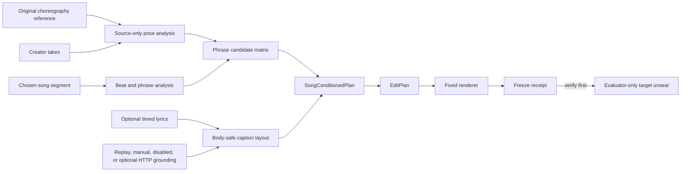

# Song-conditioned choreography pipeline

## Product contract

NodeVideo's primary workflow edits repeated dance takes against the choreography and music the
creator intended. Generation accepts:

1. one original choreography reference, used for analysis and never as render footage;
2. one or more creator takes;
3. an exact user-chosen song segment; and
4. optional timed lyrics supplied or cleared by the creator.

A finished edit is not accepted by the generator CLI. Its read log and freeze receipt audit that
allowlist before evaluation; this is not an OS-enforced filesystem sandbox.



Camera audio from every take is muted. The chosen song is the timing authority and is routed to the
music bus only when the creator's rights attestation permits preview/export. Otherwise NodeVideo
produces a muted timing guide and an Instagram handoff instead of redistributing commercial audio.

## Source-only interpretation

The analysis path is deterministic and inspectable:

- Upstream pose extraction produces time-indexed landmarks for the choreography reference and each
  take. The source-only analyzer normalizes the poses, searches each take's choreography offset, and
  scores pose agreement, completeness, framing, expression, and body-safe layout space.
- The selected song segment is decoded independently. `librosa` supplies tempo, beats, downbeats,
  onset strength, and evidence IDs; the final target does not supply picture decisions.
- The default short-form taste prior divides the hook into **12 / 16 / 6 / 10 beats**: hook, build,
  accent, response, then the remaining segment as resolution. Each accumulated boundary is snapped
  to the nearest detected beat.
- That beat grammar is a reusable and overridable template, not a universal dance-editing law. It
  makes the current decision policy auditable while future blinded preference data can replace or
  tune it.
- Every phrase receives candidates from all eligible takes. A quality gate permits an intentional
  contrast cut only when the alternate take is within the configured score tolerance.
- Body/face regions are normalized to the rotation-corrected frame. Timed lyric boxes must remain in
  the safe area and outside the grounded subject; missing or ambiguous grounding requires manual
  resolution rather than invented geometry.

The lightweight analyzer accepts precomputed pose tracks so the public replay and CPU-only checks do
not need a pose model:

```powershell
python scripts/analysis/song_choreography_analyzer.py --help
```

## Canonical artifacts

| Artifact | Schema | Responsibility |
| --- | --- | --- |
| `ChoreographyAnalysis` | `nodevideo.choreography-analysis.v1` | Binds reference, song excerpt, beat evidence, take alignments, phrases, candidates, and caption layout evidence. |
| `SongConditionedPlan` | `nodevideo.song-conditioned-plan.v1` | Selects one eligible candidate per phrase and binds caption layout plus the compiled EditPlan hash. |
| `EditPlan` | `nodevideo.edit-plan.v1` | Carries the contiguous video timeline, muted take-audio routes, chosen-song event, overlays, beat grid, and explicit lineage. It cannot contain arbitrary renderer code. |
| `Freeze` | `nodevideo.choreography-freeze.v1` plus the wrapper freeze receipt | Hash-binds admitted inputs, analysis, plan, render, generation read log, and zero forbidden target reads. |

The real-case source-only analyzer currently records its richer intermediate as
`nodevideo.song-choreography-analysis.v1` before compiling the same `EditPlan` and freeze boundary.
The renderer remains [`scripts/workers/edit-plan-renderer.mjs`](../scripts/workers/edit-plan-renderer.mjs):
the planner changes typed data, not FFmpeg or UI code for each edit.

The evaluator in
[`scripts/quality/evaluate-song-conditioned.mjs`](../scripts/quality/evaluate-song-conditioned.mjs)
first verifies every frozen generation hash and the target-isolation attestations. Only then does it
open a separate evaluator-only EditPlan. It fails if the target was frozen with generation files, if
target-derived identifiers leak into source-only artifacts, or if an undisclosed target-audio oracle
is present.

## Provider-neutral grounding

[`src/lib/visual-grounding.ts`](../src/lib/visual-grounding.ts) exposes the same locator-free,
asset-bound request/result/health contract for four modes:

| Mode | Use |
| --- | --- |
| `replay` | Deterministic checked-in geometry for CI and public proof. |
| `manual` | Creator-reviewed normalized boxes when automation is missing or ambiguous. |
| `disabled` | Explicit fail-closed mode; downstream caption placement cannot pretend grounding succeeded. |
| `LocateAnything HTTP` | Operator-managed text-prompt sidecar behind the same contract. The free proof backend uses NVIDIA's official queued Hugging Face Space; a local worker can replace it without changing callers. |

Results distinguish `valid`, `ambiguous`, `malformed`, `empty`, `failed`, and `manual`. Confidence is
stored only when a provider actually reports it; the manual and replay paths do not manufacture a
model score. Durable artifacts retain trace/asset IDs and normalized geometry, never local paths,
credentials, raw frames, thumbnails, or vendor payloads.

LocateAnything has two separate license boundaries. The upstream
[Eagle repository code](https://github.com/NVlabs/Eagle/blob/main/LICENSE) carries Apache-2.0, while
the [LocateAnything model license](https://github.com/NVlabs/Eagle/blob/main/Embodied/LICENSE_MODEL)
limits noncommercial use to research or evaluation. NodeVideo does not silently download weights or
accept that model license for the operator. The HTTP adapter activates only after separate code and
model license references and an explicit acceptance flag are declared.

NodeVideo also makes **no visual-prompt claim**. The upstream
[LocateAnything documentation](https://github.com/NVlabs/Eagle/blob/main/Embodied/README.md#visual-prompt-fine-tuning)
states that the released `nvidia/LocateAnything-3B` checkpoint does not support visual-prompt
inference out of the box. This integration uses bounded text prompts only.

Check all provider-neutral profiles without contacting a model service or downloading weights:

```powershell
npm run grounding:doctor
```

## Public synthetic replay

The six-second public fixture contains a generated choreography reference, two generated creator
takes, a public-domain generated 120 BPM song, and three timed text cues. It proves deterministic
input-to-analysis-to-plan-to-render mechanics, chosen-song routing, camera-audio muting, replay
grounding, body-safe captions, and freeze-before-evaluation. It does **not** prove taste, arbitrary
human-pose accuracy, or live LocateAnything accuracy.

```powershell
npm run proof:song:public
```

Direct artifacts:

- [public replay manifest](../fixtures/media/song-conditioned-auto-edit-v1/manifest.json)
- [ChoreographyAnalysis](../fixtures/media/song-conditioned-auto-edit-v1/understanding.json)
- [SongConditionedPlan](../fixtures/media/song-conditioned-auto-edit-v1/song-conditioned-plan.json)
- [EditPlan](../fixtures/media/song-conditioned-auto-edit-v1/edit-plan.json)
- [freeze](../fixtures/media/song-conditioned-auto-edit-v1/choreography-freeze.json)
- [preview](../fixtures/media/song-conditioned-auto-edit-v1/preview.mp4)
- [evaluator report](../fixtures/media/song-conditioned-auto-edit-v1/evaluator-report.json)

Deployment target routes (available after this branch is published):

- [interactive NodeVideo replay](https://nodevideo-pi.vercel.app/)
- [synthetic preview](https://nodevideo-pi.vercel.app/media/song-conditioned-auto-edit-v1/preview.mp4)
- [synthetic manifest](https://nodevideo-pi.vercel.app/media/song-conditioned-auto-edit-v1/manifest.json)

Vercel serves the frozen replay bytes; it is not represented as a live browser transcoding worker.

## Supplied real-case calibration

The 44.5-second real-media run keeps the target picture and evaluator plan outside generation. It
uses Source A as a disclosed creator-selected canonical choreography fallback, aligns Source B by
normalized pose, applies the 12/16/6/10 beat template, alternates A/B/A/B/A across five phrases,
mutes both camera tracks, compiles an EditPlan, renders, and freezes. The evaluator opens the target
plan only after verifying the freeze.

| Post-freeze measure | Result |
| --- | ---: |
| Cut F1 at `0.75 s` tolerance | `0.909091` |
| Mean nearest-cut error | `0.366667 s` |
| Maximum nearest-cut error | `0.633333 s` |
| Neutral source agreement | `5 / 5` phrases |
| Duration | `44.5 s` generated / `44.5 s` target |
| Taste status | `not-evaluated` |

These `0.75 s` values are retained as legacy calibration diagnostics. They are not a successful
editorial verdict: dance-edit acceptance now requires signed one-to-one boundary errors no greater
than two frames, and this supplied-case run fails that gate.

This is a **target-picture-isolated, target-audio-oracle calibration**. The exact authorized audio
excerpt was supplied to test picture planning, so the run does not prove autonomous song identity or
excerpt selection. This case also lacks three product-correct inputs: an independent original
choreography reference, an independent creator-supplied song master/segment, and timed lyrics.
Consequently it cannot yet prove independent-reference choreography fidelity, automated lyric
placement on this footage, or generalized creative taste.

The public real-case preview contains picture only. It includes neither commercial music nor source
containers:

- [release manifest](../fixtures/media/song-conditioned-real-calibration-v1/manifest.json)
- [source-only analysis](../fixtures/media/song-conditioned-real-calibration-v1/analysis.json)
- [generated EditPlan](../fixtures/media/song-conditioned-real-calibration-v1/edit-plan.json)
- [freeze receipt](../fixtures/media/song-conditioned-real-calibration-v1/freeze-receipt.json)
- [post-freeze evaluation](../fixtures/media/song-conditioned-real-calibration-v1/post-freeze-evaluation.json)
- [silent picture preview](../fixtures/media/song-conditioned-real-calibration-v1/picture-only-preview.mp4)
- [silent-preview deployment route](https://nodevideo-pi.vercel.app/media/song-conditioned-real-calibration-v1/picture-only-preview.mp4)
- [score-manifest deployment route](https://nodevideo-pi.vercel.app/media/song-conditioned-real-calibration-v1/manifest.json)

Verify the checked-in release without reading private source paths:

```powershell
npm run proof:song:real:verify
```

The exact private evaluation command is intentionally two-phase; the target plan is listed only on
the evaluator command and is absent from the generator interface:

```powershell
npm run eval:song -- `
  --freeze .qa/evidence/private/song-conditioned-source-only-v1/freeze-receipt.json `
  --generated-plan .qa/evidence/private/song-conditioned-source-only-v1/edit-plan.json `
  --target-plan .qa/evidence/private/reference-analysis-v2/edit-plan-reviewed.json `
  --output .qa/evidence/private/song-conditioned-source-only-v1/post-freeze-evaluation.json `
  --allow-target-audio-oracle
```

Do not run that evaluator until the generation freeze already exists. A normal source-only case must
omit `--allow-target-audio-oracle`.

## Music and Instagram handoff

NodeVideo treats music timing and music distribution as different responsibilities:

- With owned or otherwise authorized audio, the chosen excerpt can drive preview/export directly and
  its rights attestation remains in the artifact lineage.
- With an Instagram catalog recording, NodeVideo can provide track/search identity, the intended
  segment, beat/phrase anchors, and visual placement instructions. The creator adds and confirms the
  recording inside Instagram, where catalog availability and licensing are handled for that account
  and region.
- NodeVideo does not claim that an external catalog preview has the same waveform offset as the
  Instagram recording until the creator confirms it in the platform.
- Commercial audio is never added to a public proof merely to make the replay sound complete.

## One-command health check

```powershell
npm run doctor
```

`doctor` validates both capability packs, exercises replay/manual/disabled grounding without a model
download, verifies the original synthetic worker, and verifies the song-conditioned public replay.
